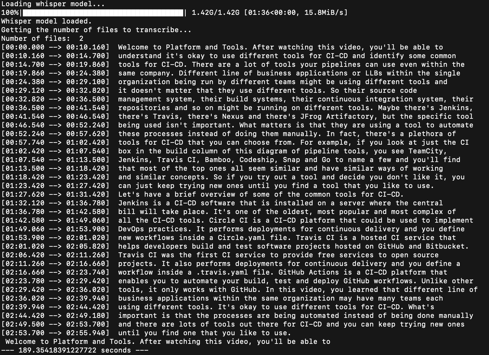

# audio-text-transcription

This repository will transcribe audio files or audio in video files to text using [Whisper](https://openai.com/research/whisper).

# Setup

1. I created a Python virtual environment using Python 3.9.16.

    ```shell
    python3 - m audio_transcribe venv
    ```

2. I activated the environment.

    ```shell
    source audio_transcribe/bin/activate
    ```

    * To deactivate the environment, type and run `deactivate`.

3. I installed Whisper and the required dependencies using the following steps as mentioned on the [Whisper GitHub repo](https://github.com/openai/whisper)

    * `pip install -U openai-whisper`
    * `brew install ffmpeg`
    * `pip install setuptools-rust`

# Execution

1. From the command line, run the [`audio_to_text.py`](script/audio_to_text.py) file:

    * `python audio_to_text.py`

2. You'll be prompted to provide the path to the directory containing the `.mp4`, `.mp3`, or .`wav` files.

    * `"What is the path to the directory? "`

3. Paste in the path to the directory and press enter.

4. In Python script, I have the parameter, `verbose` set to `True` (`verbose=True`) to output timestamps of the file being transcribed along with the transcription.

    

    * The first time you run the script the model will download, which may take a few minutes.


* **Note:** I transcribed two `.mp4` files from an edX course that I am taking, "Continuous Integration and Delivery (CI/CD)". Total size was 16Mb and the script took about 4 minutes to convert the files to [text files](text_files).

## Pros

* There is no API key needed.
* There are few dependencies.

## Cons

* Will only transcribe from a foreign language to English, not English to a target language.

## TO DO:

* Use smaller models, `tiny.en`, `base.en`, and `small.en`, which may transcribe the files faster and compared to other models as well as the audio for accuracy.
